# Adote um Amigo 🐾

## 📌 Sobre o projeto
**Adote um Amigo** é uma aplicação web desenvolvida em **React** com o objetivo de facilitar a visualização e o interesse na adoção de animais.

O sistema apresenta **cães, gatos e outros animais** disponíveis para adoção, exibindo perfis detalhados, filtros de busca, orientações sobre adoção responsável e um formulário de cadastro de interesse.

O projeto foi desenvolvido como **trabalho individual acadêmico**, com foco em:

- consumo de APIs externas;
- rotas dinâmicas;
- interface amigável;
- organização do código;
- publicação online.

---

## 🚀 Funcionalidades

- Listagem de animais disponíveis para adoção
- Consumo de API externa para cães
- Consumo de API externa para gatos
- Inclusão de animais locais (hamster, coelho, calopsita, porquinho-da-índia e outros)
- Página de detalhes de cada animal
- Botão **Quero adotar** na página de detalhes
- Redirecionamento para o cadastro com animal pré-selecionado
- Filtros por:
  - nome
  - espécie
  - cidade
- Ordenação por:
  - Nome A-Z
  - Nome Z-A
  - Espécie
- Botão para limpar filtros
- Página de orientações para adoção responsável
- Formulário de cadastro com validação de:
  - nome
  - e-mail
  - telefone
  - idade
  - estado
  - cidade
  - animal de interesse
  - mensagem
- Seleção de estados e cidades do Brasil via API do IBGE
- Layout responsivo
- Rodapé informativo

---

## 🛠️ Tecnologias utilizadas

- React
- React Router DOM
- JavaScript (ES6+)
- CSS3
- Axios
- Create React App

### APIs utilizadas
- The Dog API
- The Cat API
- API de localidades do IBGE

---

## 🌐 Link da aplicação online

[🔗 Acesse o aplicativo online](http://adote-um-amigo-nine.vercel.app)

---

## 📂 Estrutura básica do projeto

src/
├── components/
│   ├── Navbar.js
│   ├── Footer.js
│   ├── Header.js
│   └── AnimalCard.js
│
├── pages/
│   ├── Home.js
│   ├── Animals.js
│   ├── AnimalDetails.js
│   ├── Tips.js
│   └── Register.js
│
├── services/
│   └── api.js
│
├── App.js
├── App.css
└── index.js

Aplicativo
├── Barra de Navegação
├── Rotas
│   ├── Início
│   ├── Animais
│   │   └── Ficha do Animal
│   ├── Detalhes do Animal
│   ├── Dicas
│   └── Cadastre-se
└── Rodapé

Organização das páginas e componentes
Animals : listagem dos animais com filtros e ordenação
AnimalDetails : exibe detalhes do animal selecionado via rota dinâmica
Cadastro (Cadastro) : formulário de cadastro de interesse
Dicas (Dicas) : orientações para adoção responsável
Rodapé (Rodapé) : bloco informativo no final da aplicação
services/api.js : centraliza as chamadas às APIs externas

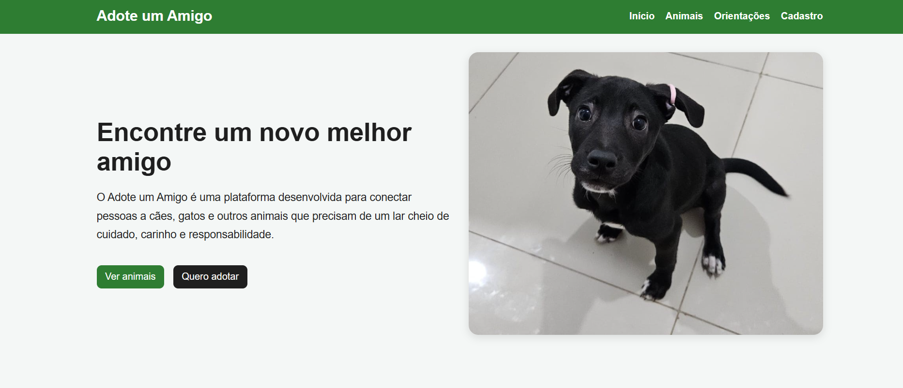
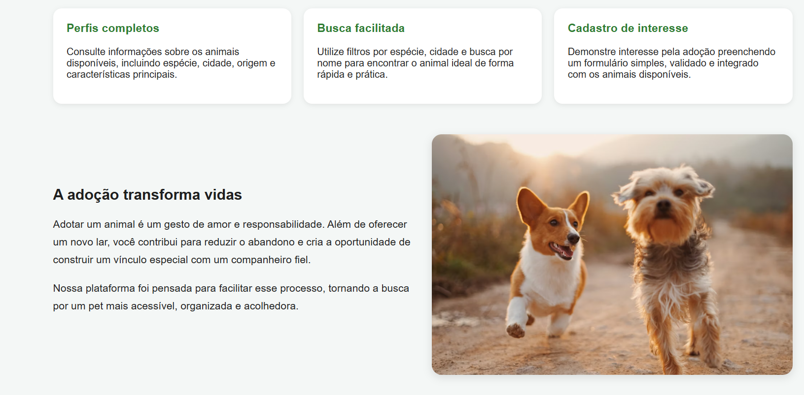
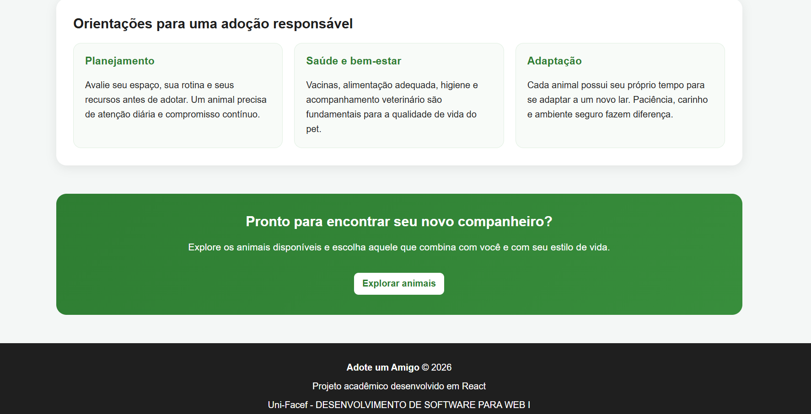
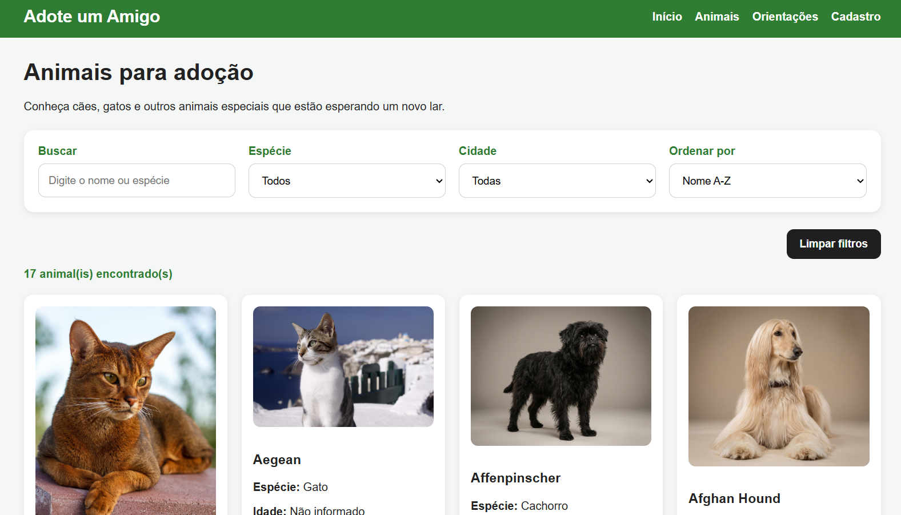 
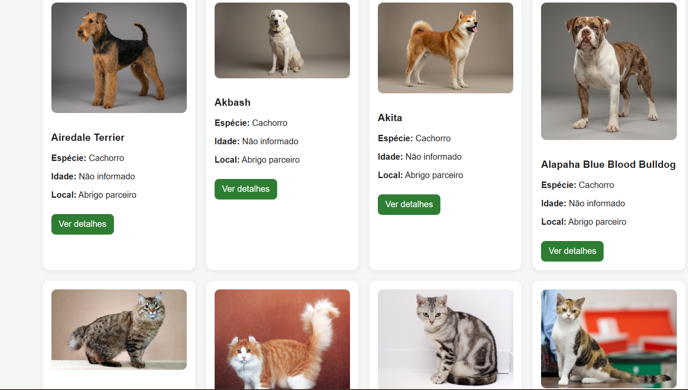 
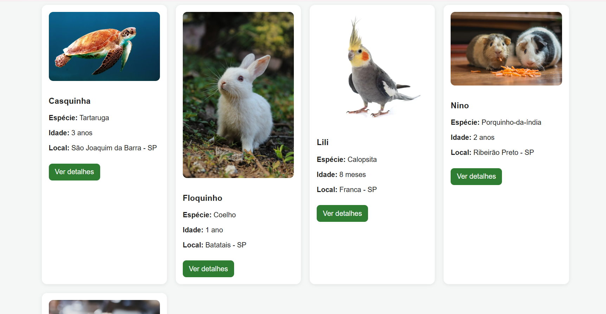 
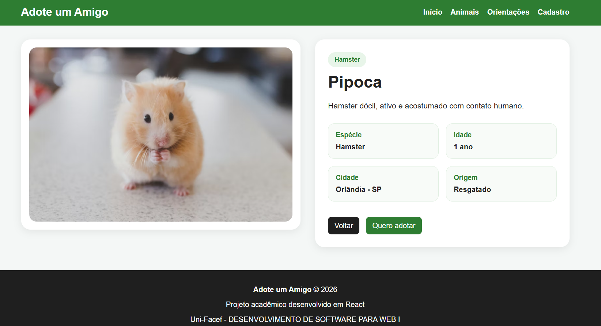 
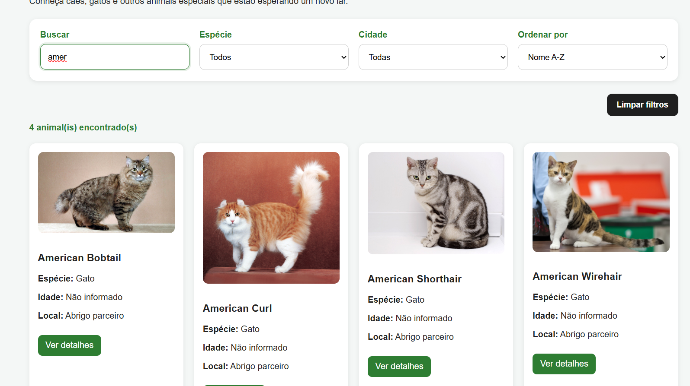 
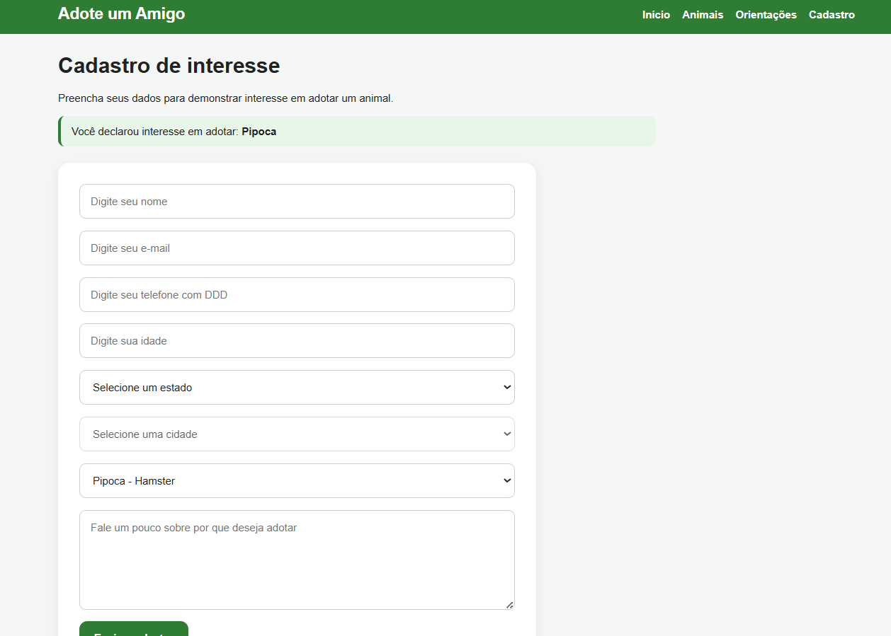 
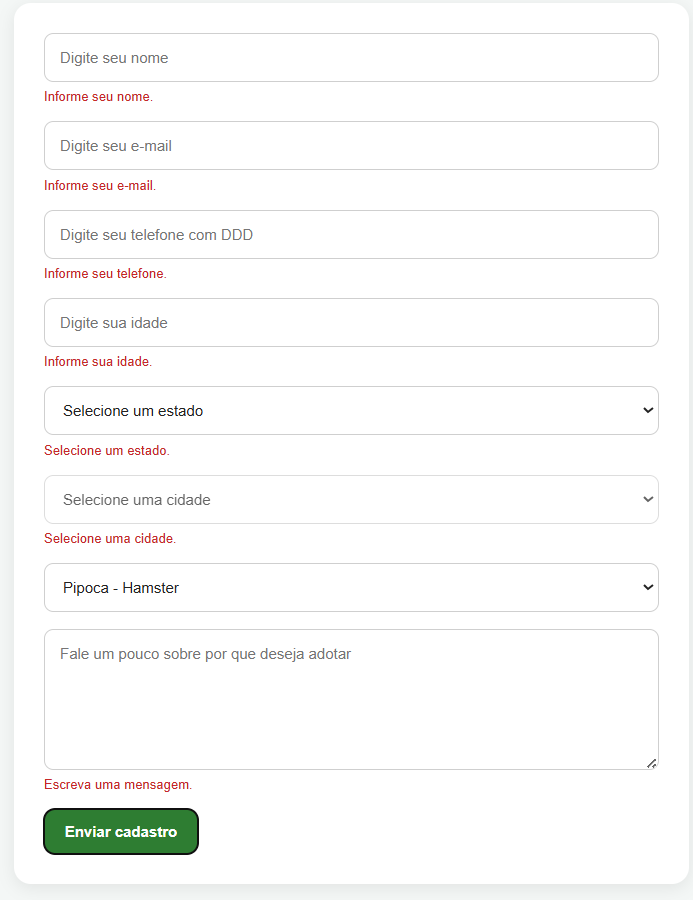 
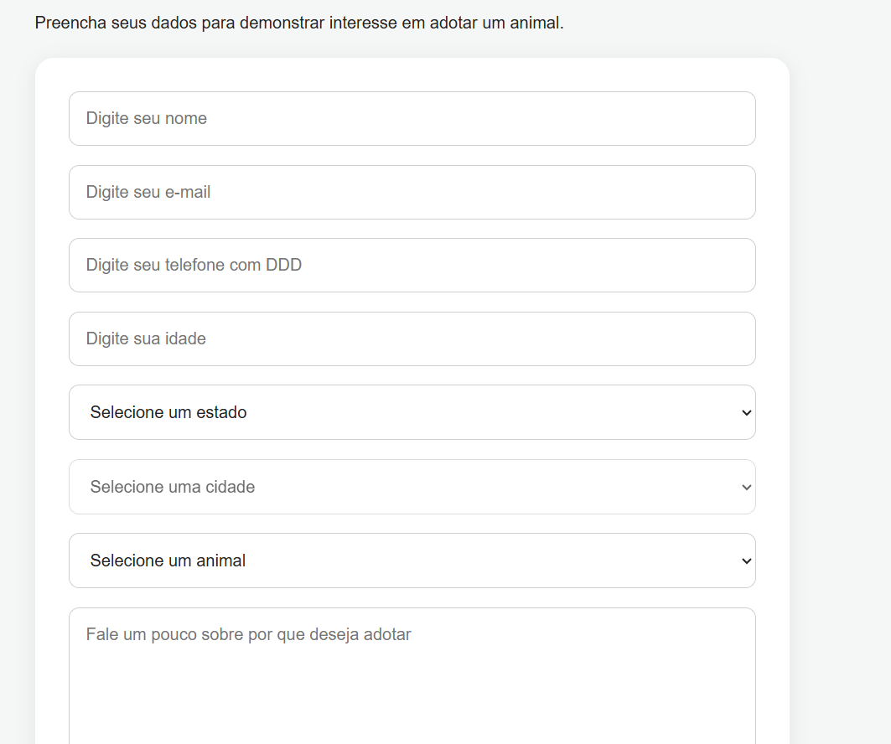 
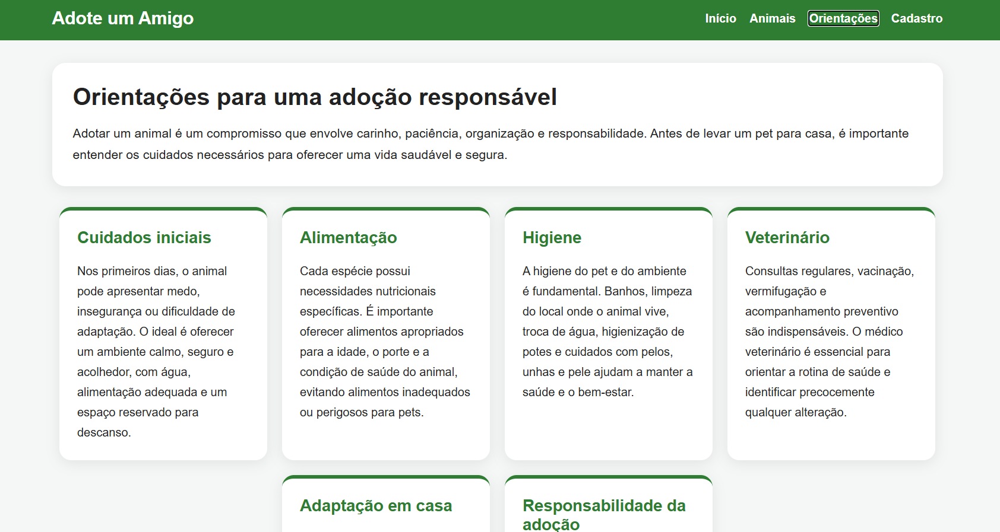
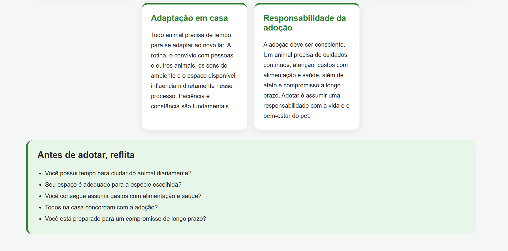
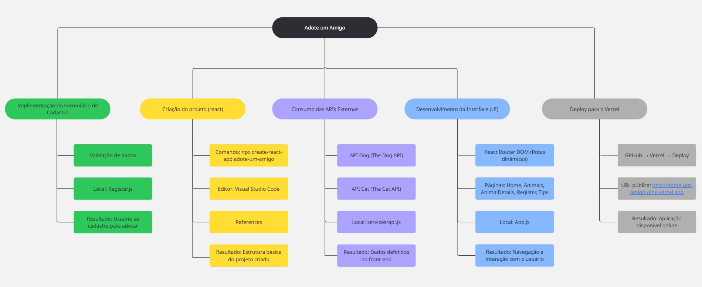
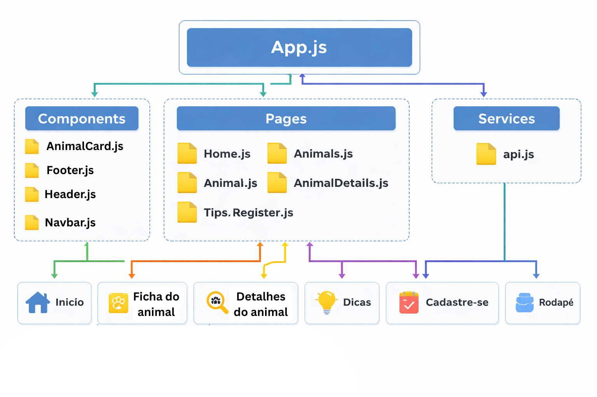

⚙️ Como executar o projeto localmente
1. Clonar o repositório
git clone https://github.com/lanacarol/adote-um-amigo.git
2. Acessar a pasta do projeto
cd adote-um-amigo
3. Instalar as dependências
npm install
4. Criar o arquivo .env

Na raiz do projeto, crie um arquivo chamado .env e adicione:

REACT_APP_DOG_API_KEY=sua_chave_aqui 
REACT_APP_CAT_API_KEY=sua_chave_aqui
5. Executar o projeto
npm start 

O aplicativo será aberto em:

http://localhost:3000

📚 Considerações finais

O projeto Adote um Amigo foi desenvolvido com o propósito de aplicar, na prática, conceitos fundamentais do desenvolvimento front-end com React, incluindo:

consumo de APIs externas;
componentização;
roteamento com rotas dinâmicas;
manipulação de estados;
formulários com validação;
integração com serviços externos;
publicação em ambiente online.

Além do aspecto técnico, o sistema também busca promover a conscientização sobre a adoção responsável de animais , unindo tecnologia e propósito social em uma aplicação funcional, organizada e intuitiva.

👩‍💻 Autora

Projeto desenvolvido por Lana Molina como trabalho acadêmico individual para a disciplina de desenvolvimento web com React.